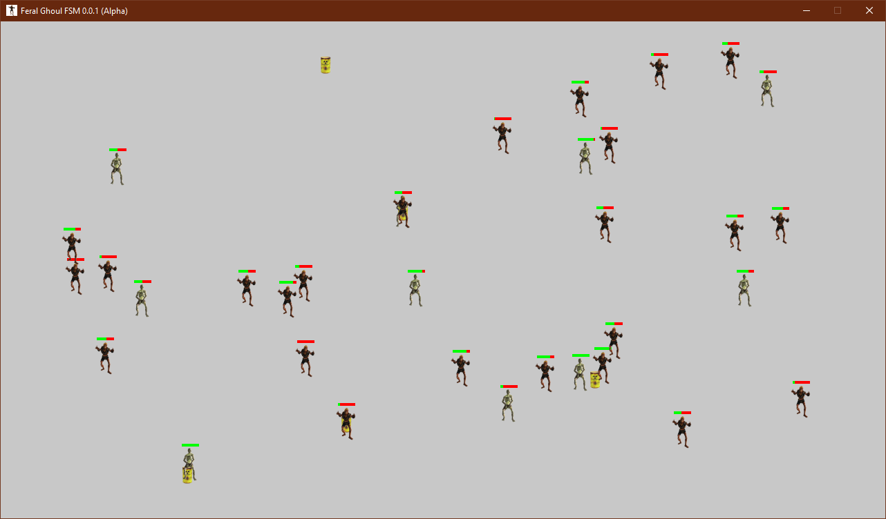

**Feral Ghoul FSM 0.0.1a**
==========================

**Feral Ghoul FSM 0.0.1a** is a **Python 3.9** finite-state machine for modeling the behaviors of feral ghouls from Fallout 3 using NPC characteristics and modifiers from the Traveller RPG. The ghouls are spawned in an injured state and will look for ways to heal themselves.

Feral ghouls will stand near drums to heal themselves if they are below 50% health.

Glowing feral ghouls will heal rapidly if next to a drum. They can also heal regular feral ghouls that are near them. But only when they are at 100% health.

Regular feral ghouls cannot heal anything.

Notes
-----

**Feral Ghoul FSM 0.0.1a** has been tested already on Windows 10. For the **gameobjects** library imported into this program, you will need the book titled: Beginning Game Development with Python and Pygame 2nd Edition, by Will McGugan.

The Traveller game in all forms is owned by Far Future Enterprises. Copyright 1977 - 2022 Far Future Enterprises. Traveller is a registered trademark of Far Future Enterprises.

Contact
-------
Questions? Please contact shawndriscoll@hotmail.com
